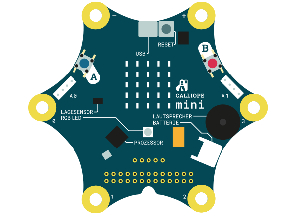

= Workshops for calliope mini (http://calliope.cc/)

 

== Build sources
Make sure you have asciidoctor installed. If you are using ruby, install it with bundler:

[source,bash]
---
#gem install bundler
---

In the project directory type:

[source,bash]
---
#bundle install
---

Compile the sources by following command:

[source,bash]
---
#asciidoc README.adoc
#cd de
#bundle exec asciidoctor-revealjs slides.adoc
---

If you want to export the slides to pdf simply add ``?print-pdf`` to the end of the slide-url in your browser

Complie the worshop handouts using following command:

[source, bash]
---
#cd de
# bundle exec asciidoctor-pdf -r asciidoctor-diagram aufgaben.adoc
---