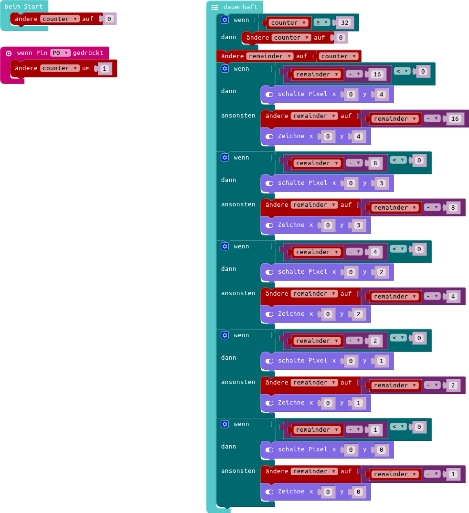
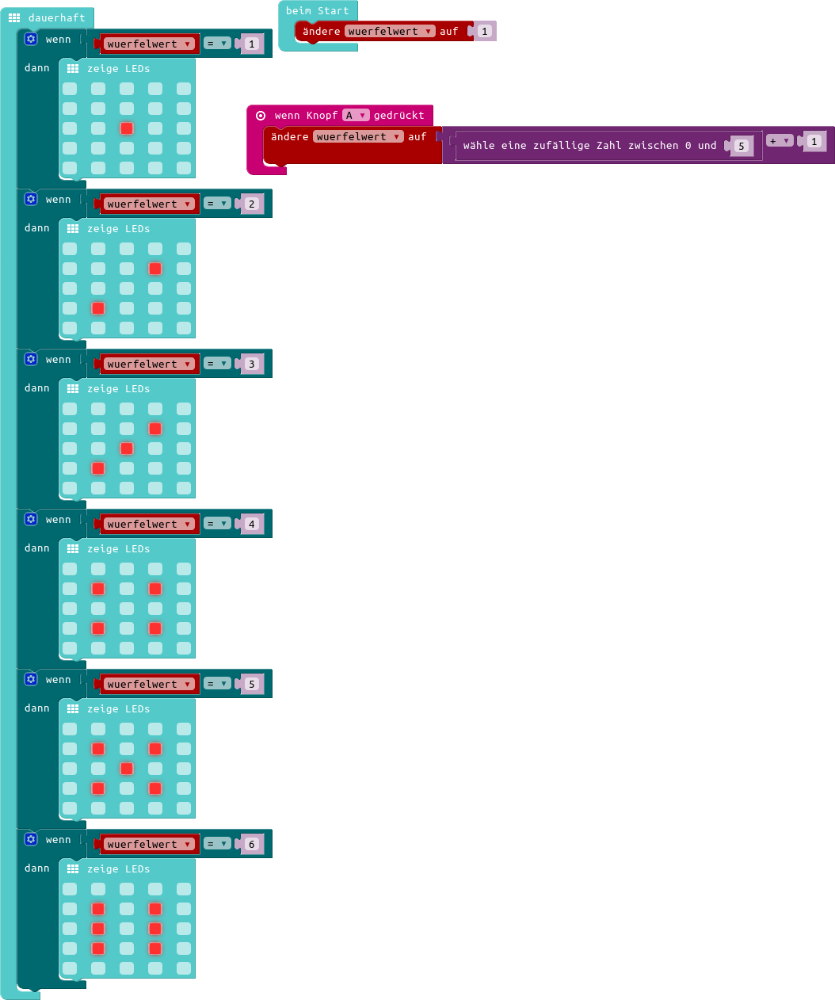
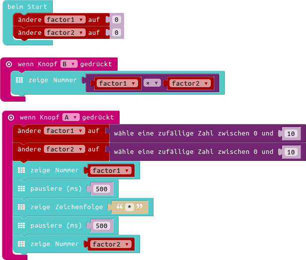
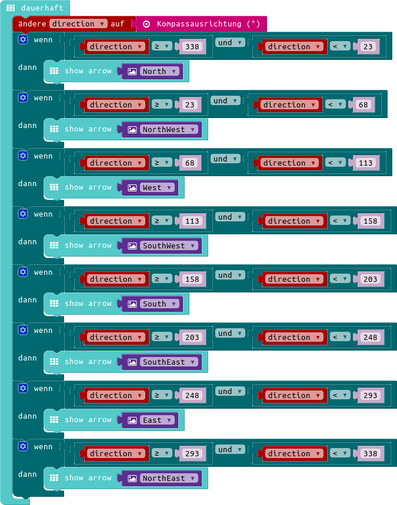
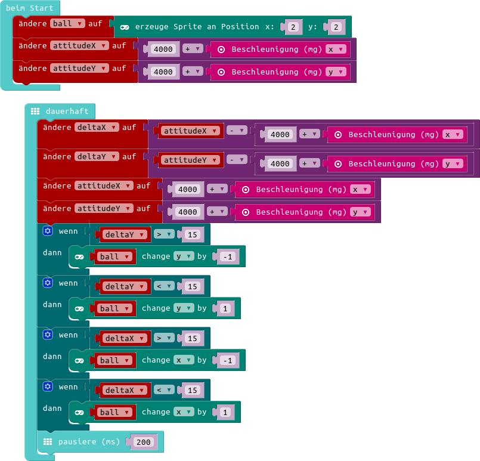

= Calliope Workshop
Folgende Aufgaben sollen dir helfen den Calliope näher kennenzulernen.

== Vorbereitung

. Schließe dazu den Calliope an einen USB-Port deines Computers an.
. Der Compunter meldet ein neues Laufwerk dem Namen `MINI`. 
. Wähle dieses aus und es erscheint ein Ordner mit zwei Dateien `DETAILS.TXT` und `MINI.HTM`
. Die Dateien sind nicht wichtig. Wenn ihr aber euer Programm auf den Calliope übertragen wollt, müsst ihr das Programm in diesen Ordner kopieren
. Euer Calliope ist nun fertig eingerichtet
. Ihr könnt nun einen Editor unter http://calliope.cc/editor wählen und mit den Aufgaben beginnen.

== Aufgabe 1 - Ausgaben
Der Calliope hat viele Möglichkeiten Dinge auszugeben, dies wollen wir nun kennenlernen:

. Gebe auf dem Calliope einen Text aus.
. Lasse die LED in einer Farbe leuchten.
. Gebe einen Ton auf den Calliope aus.

== Aufgabe 2 - Eingaben und Verzeigungen
Der Calliope kann auch Eingaben verarbeiten und Entscheidungen treffen, das probieren wir jetzt aus:

. Gebe auf dem Calliope einen Text aus, wenn du Taste `A` drückst.
. Gebe einen anderen Text aus, wenn du Taste `B` drückst.
. Gebe die aktuelle Temperatur aus.

== Aufgabe 3 - Schleifen
Manchmal sollen Dinge häufiger gemacht werden und das wollen wir jetzt kennenlernen:

. Erzeuge eine Vairable/einen Platzhalter `zaehler`.
. Setze den Zähler auf den Wert 0.
. Erzeuge eine Schleife in der du den Zähler immer um 1 erhöhst.
. Gebe den Wert des Zählers nach jeder Erhöhung aus.

<<<
== Aufgabe4 - freies Programmieren

Wir haben ein paar Programmideen vorbereitet aus denen du eine auswählen kannst. Dein Mentor/deine Mentorin wird dir bei der Lösung helfen. Wenn du eine eigene Idee hast kannst du die auch zusammen mit deinem Mentor lösen. 

Folgende Ideen haben wir vorbereitet:

* Ein Zähler der den Zählerstand im Binärformat d.h. als duale Zahl anzeigt. 
* Einen Würfel.
* Einen Kopfrechentrainer.
* Einen Kompass, der dir die Richtung nach Norden zeigt.
* Eine leuchtende LED, die du auf der LED-Matrix balancieren kannst.

<<<
== Musterlösungen

=== binärer Zähler

<<<
=== Würfel

<<< 
=== Kopfrechentrainer

<<<
=== Kompass

<<<
=== LED balancieren

