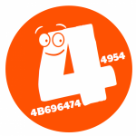
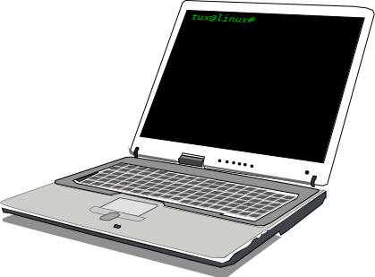
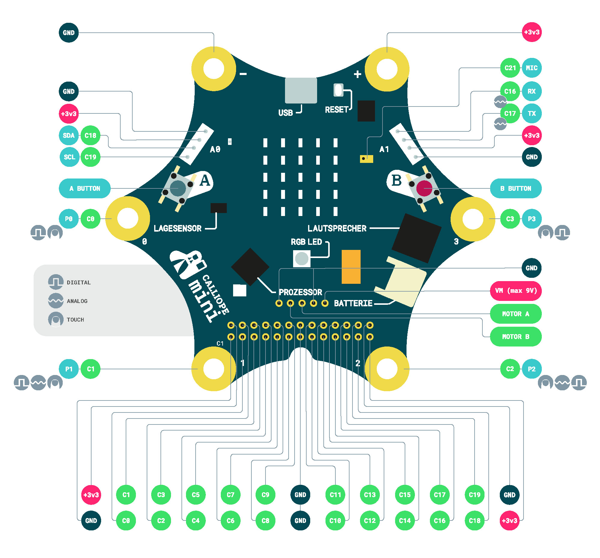
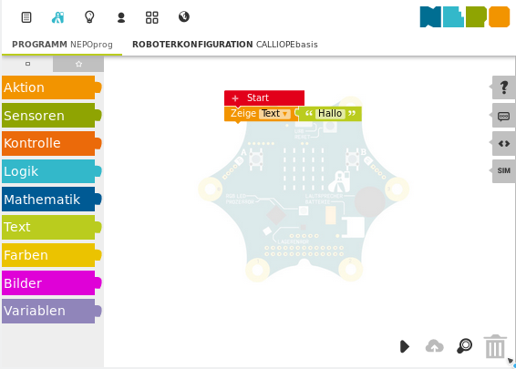
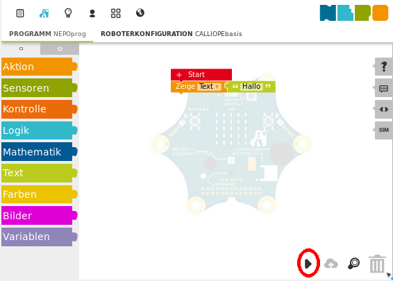
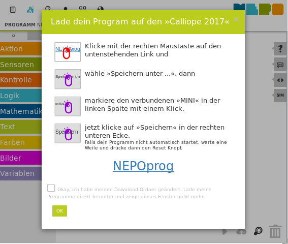
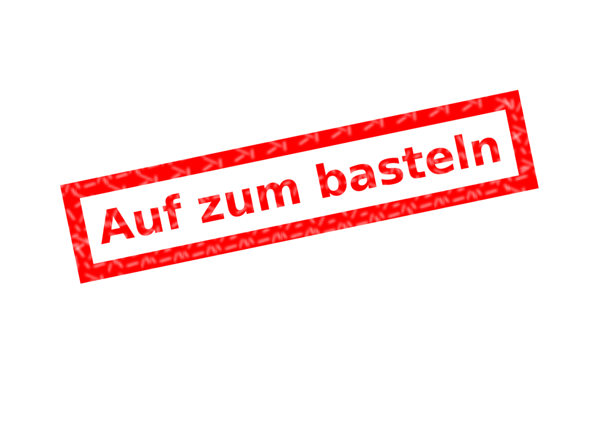

//intro slides for the calliope workshop
// 10.2017 theOpenbit (tob at schoenesnetz de)
:revealjsdir: ../resources/reveal.js
:revealjs_theme: simple
:revealjs_progress: true
:revealjs_slideNumber: true
:customcss: ../resources/overwrite.css

== !

image:../resources/mini_board.png[calliope mini,416,280, link="https://calliope.cc"]

[.float-group]


 


[transition="zoom"]
== Programmieren??


* Computer sagen was er tun soll 
* Programme sind wie Kochrezepte



[transition="zoom"]
== Was ist der  ?

* Ist ein Lerncomputer, den wir programmieren können
* Wir können damit
** Texte ausgeben
** Temperatur messen
** Töne ausgeben und Geräusche aufnehmen
** Bewegung und die  Himmelsrichtung messen
** ...

[%notitle, transition="zoom"]
== Pinout

[.center]
 

(C)cc-by-sa https://calliope.cc

[transition="zoom"]
== Wie wird programmiert?
* es gibt viele verschiedene Anwendungen dafür
** http://calliope.cc/editor
* meistens programmiert man mit grafischen Anweisungsblöcke
* die Anweisungsblöcke werden mit der Maus aneinander gesetzt
* das fertige Programm wird übersetzt
* anschließend wird es auf den Calliope kopiert


[transition="zoom"]
== ein erstes Programm
 

[transition="zoom"]
== Programm auf Calliope laden
 

[transition="zoom"]
== Programm auf Calliope laden
 

[transition="zoom"]
== Programm auf Calliope laden
* im Download-Ordner steht nun eine Datei mit der Endung ```hex```
* den Calliope mit dem USB-Kabel an den Computer anschließend
* die heruntergeladene Datei auf das Laufwerk ```MINI``` kopieren

fertig!


[%notitle, transition="zoom"]
== los geht's
--
image:../resources/mini_board.png[calliope mini,416,280, link="https://calliope.cc",align="center"]
[.stackimage]



--


